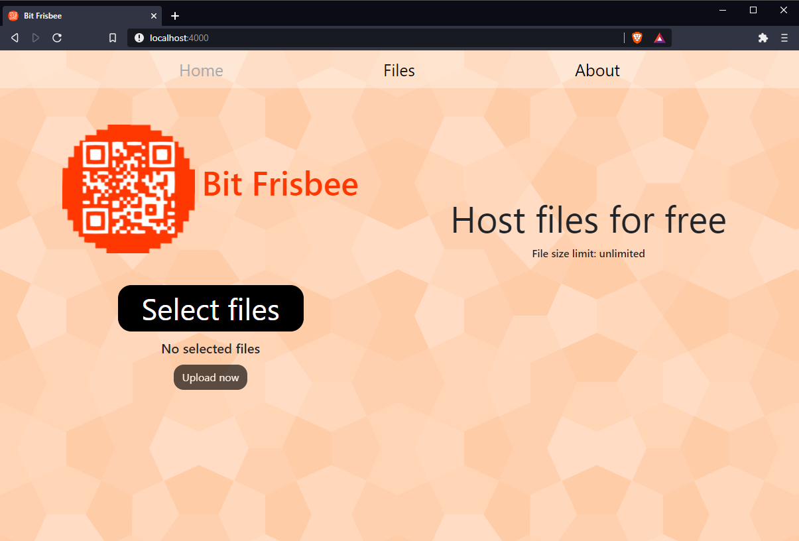

#  Bit Frisbee

A simple file hosting server. <a href="http://split-vice.com/technology/web-software/bit-frisbee/" target="_blank">Official website</a>

# Technical specs

Developed in Node v12.16.2. Bit Frisbee needs Node to be installed on the PC to be executed.

[Node official website](https://nodejs.org/en/)

Bit Frisbee uses VueJS frontend which has been developed in a separated project. To run the application it is only needed to run the backend project. No database needed.

Uploaded files will be stored at `/backend/src/public/f/`

Bit Frisbee works with <a target="_blank" href="https://ngrok.com/">Ngrok</a>.

# Web application setup
- Download application from repository.
- Quick start: run `Build frontend.bat` and then `Start server.bat`.
- Manual start: run `npm run build` on terminal while being at `/frontend` folder. Then run `npm install` and `npm start` on terminal while being at `/backend` folder for manual application start.

### Detailed setup and environment variables
Check the setup guide file at `/_Docs/Guides/Setup app.txt` for specific details of app deployment, environment variables, and developer mode.

# Installing application

Bit Frisbee can be installed on PCs with Windows operating system by running the file called `Install/Install Bit Frisbee.bat`. The application will start automatically on Windows startup and run on the background.

This is made by using <a target="_blank" href="https://www.npmjs.com/package/node-windows">node-windows</a> module.

To uninstall application tun `Install/Uninstall Bit Frisbee.bat`.

### Support?
<a target="_blank" href="https://split-vice.com/send-message">Contact me</a>